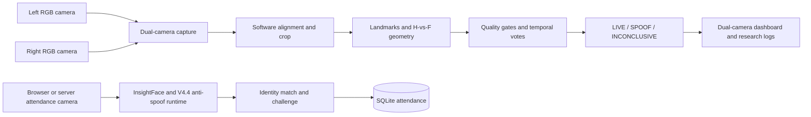

# Architecture and source ownership

The system has two camera paths in one FastAPI application. The stereo path is an experimental liveness demo. The attendance path retains the V4.4 scanner and compatibility routes.

There is no automatic arrow from the stereo verdict to the attendance record. Dense/deep research scripts are also separate from the live sparse endpoint. Static pixel shift and crop in `core/stereo_alignment.py` are not a calibrated stereo rectification pipeline; the calibration evidence reported in the paper is a separate artifact.

| Concern | Canonical source | Runtime/derived form | Verification |
| --- | --- | --- | --- |
| App and routes | `main.py`, `app/routes/` | FastAPI process | `/health`, `/ready`, endpoint smoke |
| Dual-camera capture | `core/camera.py`, `core/dual_camera.py` | Free-running webcam threads | Two-camera hardware smoke |
| Sparse stereo liveness | `core/stereo_liveness.py`, `core/stereo_alignment.py`, `config.py` | Temporal verdict and optional JSON logs | `tests/test_stereo_liveness.py`; real clips separately |
| Attendance | `core/runtime_v4.py`, `core/detect_v4.py`, `core/face_engine.py` | Match, challenge, attendance entries | Existing non-integration tests and manual flow |
| Research experiments | `research/stereo_matching/` | Plots/disparity maps in ignored output paths | Experiment-specific invocation and input provenance |
| Pilot evidence | `results/pilot/` | Archived numeric CSV/JSON | `scripts/reproduce_pilot_metrics.py` |
| Deployment source | `Dockerfile`, `docker-compose.yml`, `docker/entrypoint.sh` | Built image and live container | Build log, readiness, device smoke |
| Models and enrollment | Download script; private local capture | `models/`, embeddings, SQLite | Model/rig versions and private validation |

`config.py` reads process environment variables and creates runtime directories when imported. `.env.example` is a reference; local `python main.py` does not automatically load `.env`. Compose uses its explicit `environment` mapping. Camera indices and alignment parameters belong to a particular rig.

The cameras have host timestamps, not hardware exposure synchronization. Model weights are downloaded externally and have their own licenses. The app has no authentication; its intended test environment is a trusted local network. Database, images, model files, and logs are mutable state, not portable Git source.

The repository keeps the established source layout so existing imports and entrypoints continue to resolve. `docs/15-realignment-plan.md` records an earlier migration and is historical. Current development and delivery rules are in [development](development.md); research evidence boundaries are in [reproduction](reproduction.md).
